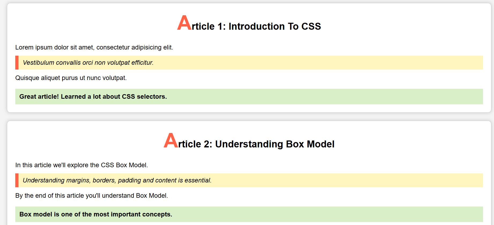
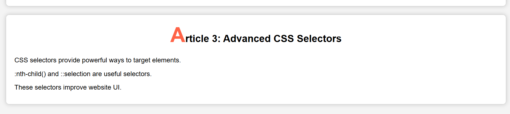

# CSS Article Cards

A simple HTML and CSS project that demonstrates the practical use of CSS styling by creating article cards.

## Features

- HTML5 Structure
- CSS Box Model
- Text Styling
- Border Radius
- Box Shadow
- Background Colors
- Blockquote Style
- Responsive Card Layout

## Technologies Used

- HTML5
- CSS3

## Project Structure

```
Project/
│── index.html
│── style.css
└── README.md
```

## Output

The project contains three article cards with:

- Large styled first letter
- Highlighted quote section
- Green information box
- Rounded borders
- Box shadow


## Output




## CSS Concepts Used


- Class Selectors
- Universal Selector
- Text Styling
- Box Model
- Margin
- Padding
- Border
- Border Radius
- Background Color
- Box Shadow
- Line Height


## Author

**Jaymit Parmar**