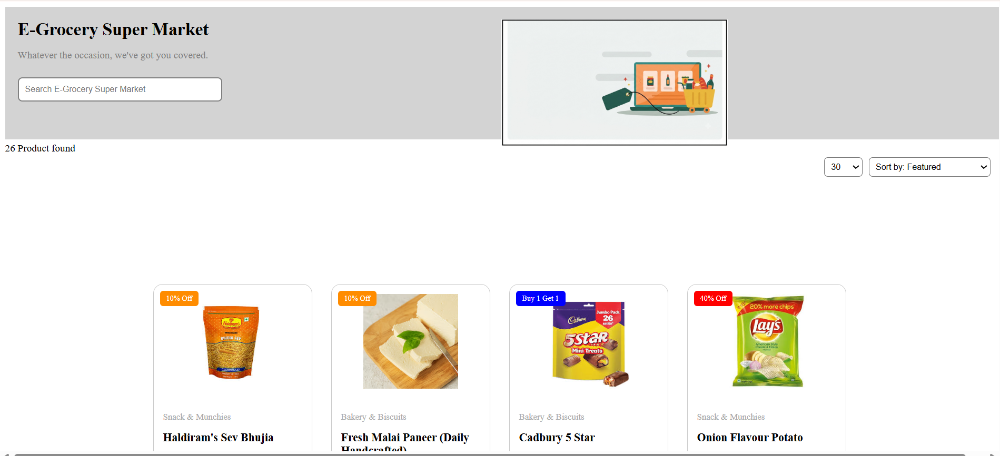
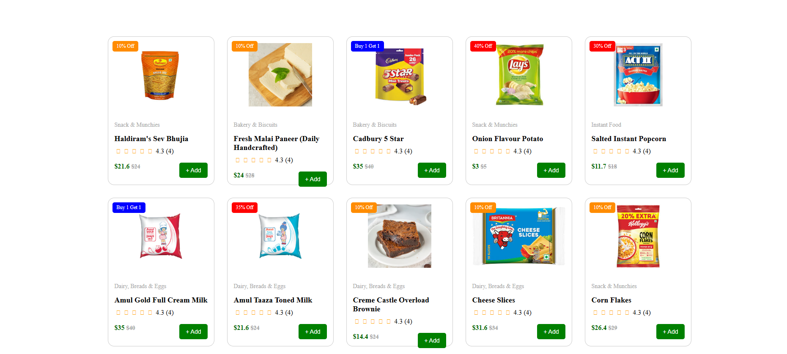

# 🛒 E-Grocery Super Market

A modern and responsive **E-Grocery Super Market** landing page built using **HTML5** and **CSS3**. This project showcases an online grocery product listing with attractive product cards, discount badges, ratings, pricing, and search functionality.

---

## 🚀 Features

- 🛍️ Attractive Grocery Product Cards
- 🔍 Search Bar UI
- 🏷️ Discount & Offer Badges
- ⭐ Product Ratings with Font Awesome Icons
- 💲 Product Price & Discount Price
- ➕ Add to Cart Button
- 📱 Clean and Responsive Layout
- 🎨 Modern User Interface

---

## 🛠️ Technologies Used

- HTML5
- CSS3
- Font Awesome Icons

---

## 📂 Project Structure

```
E-Grocery-Super-Market/
│── index.html
│── style.css
│── README.md
│
├── images/
│   ├── 1.png
│   ├── sev bhujia.jpeg
│   ├── paneer.png
│   ├── cadbury5star.jpeg
│   ├── onion potato chips.jpeg
│   ├── salted instant popcorn.jpeg
│   ├── amul milk1.png
│   ├── amul milk2.png
│   ├── cake.png
│   ├── cheese slices.jpeg
│   └── corn flakes.jpeg
│
└── font/
    └── all.min.css
```

---

## 📸 Preview

### Header
- Grocery Store Logo
- Search Bar
- Banner Image

### Product Section
- Product Image
- Product Category
- Product Name
- Star Rating
- Discount Price
- Add Button

---

## 🎯 Learning Objectives

This project helped in practicing:

- HTML Semantic Structure
- CSS Flexbox
- Position Property
- Float Property
- Buttons & Hover Effects
- Product Card Design
- Image Styling
- Badges & Labels

---

## ▶️ How to Run

1. Download or Clone this repository.

```bash
git clone https://github.com/your-username/E-Grocery-Super-Market.git
```

2. Open the project folder.

3. Run `index.html` in your browser.

---

## 📸 Project Preview
├── homepage.png

├── products.png


```

---

## 👨‍💻 Author

**Jaymit Parmar**

- GitHub: https://github.com/your-username

---

## 📄 License

This project is created for learning and practice purposes only.

⭐ If you like this project, don't forget to Star the repository.