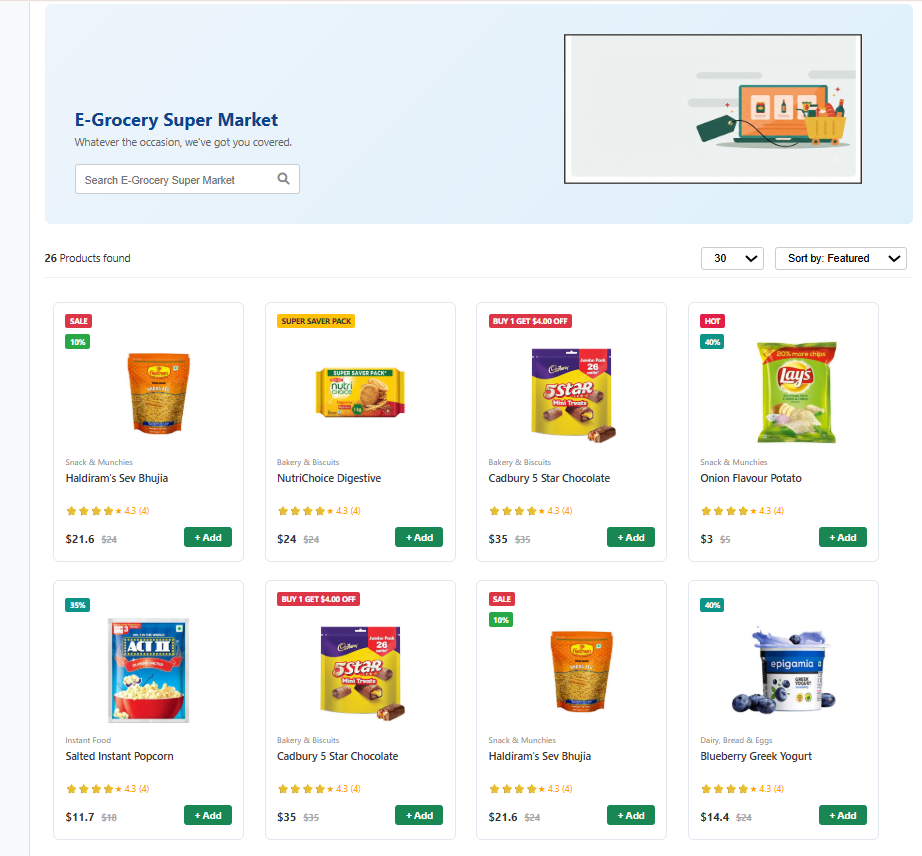

# 🛒 E-Grocery Super Market

## 📌 Project Overview

E-Grocery Super Market is a responsive grocery shopping website UI created using HTML and CSS.  
This project demonstrates the practical implementation of different CSS concepts like layout designing, product cards, badges, gradients, box model, display properties, and styling techniques.

The website represents an online grocery store where users can view products, prices, ratings, discounts, and add products to the cart.

---

## 🚀 Features

- Modern E-Grocery store user interface
- Product card layout design
- Product images with details
- Discount and sale badges
- Product rating section
- Search bar design
- Sorting and filter options
- Responsive grid-based product display
- Gradient background header
- Add button styling

---

## 🛠️ Technologies Used

- HTML5
- CSS3
- Font Awesome Icons

---

## 📚 CSS Concepts Used

### Display Properties
- Block
- Inline
- Inline-block
- None

### Box Model
- Width
- Padding
- Margin
- Border
- Border-radius

### Text Styling
- Font family
- Font size
- Text alignment
- Text transformation

### Layout Techniques
- Float property
- Clear property
- Product card alignment
- Header layout

### Background Styling
- Background colors
- Linear gradients

---

## 📂 Project Structure

```
E-Grocery-Super-Market
│
├── index.html
│
├── css
│   └── style.css
│
└── images
    ├── products images
    └── banner image
```

## 📸 Output Screenshot



---

## 🎯 Purpose of Project

The main purpose of this project is to practice and understand HTML structure and CSS styling by creating a real-world e-commerce grocery website interface.

---

## 👨‍💻 Author

**Jaymit Parmar**

---

## 📌 Future Improvements

- Add JavaScript functionality
- Add shopping cart system
- Add product search functionality
- Make fully responsive for mobile devices
- Add user login and checkout page

---

⭐ If you like this project, give it a star!